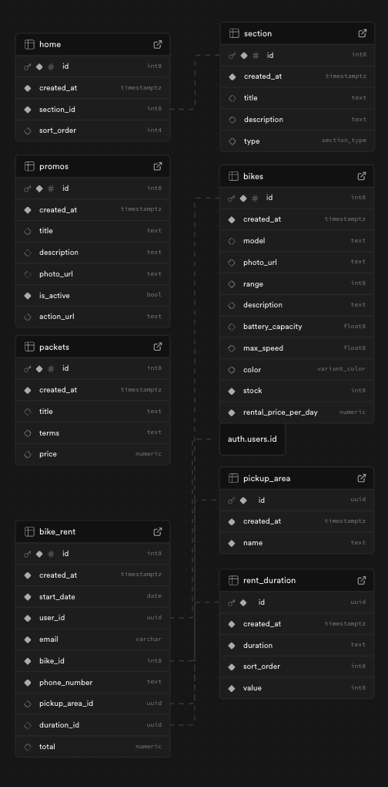

# Ezy Ride - Bike Rental Customer App

A modern Flutter-based bike rental application that allows customers to browse available bikes, view rental packages, and book bike rentals with ease.


## Table of Contents

- [Features](#features)
- [Screenshots](#screenshots)
- [Architecture](#architecture)
- [Project Structure](#project-structure)
- [Backend & Database](#backend--database)
- [Getting Started](#getting-started)
- [Dependencies](#dependencies)
- [Testing](#testing)

## Features

### Core Features
- **User Authentication**: Secure sign-up and sign-in with Supabase authentication
- **Home Feed**: Dynamic home sections with promotional banners, rental packages, and available bikes
- **Bike Browsing**: Browse and filter available bikes by color
- **Bike Details**: View detailed specifications including range, battery capacity, max speed, and pricing
- **Bike Rental**: Complete rental booking with date selection, pickup location, duration, and contact information
- **Order History**: View all past and current bike rental orders with full details
- **User Profile**: View user information and access app settings

### Technical Features
- **Smart Caching**: Rental packages are cached locally with SharedPreferences to reduce API calls and improve performance
- **Real-time Filtering**: Filter bikes by color with instant UI updates
- **Form Validation**: Comprehensive client-side validation for all user inputs
- **Error Handling**: User-friendly error messages with graceful error handling throughout the app
- **Internationalization (i18n)**: Multi-language support ready (currently English)
- **Responsive UI**: Adaptive layouts that work on different screen sizes
- **State Management**: Reactive state management with Riverpod
- **Offline-First**: Cached data ensures smooth experience even with poor connectivity

## Screenshots

<div style="display: flex; gap: 10px;">
  
  
  
</div>

## Architecture

This project follows **Clean Architecture** principles with a clear separation of concerns, making the codebase maintainable, testable, and scalable.

### Architecture Layers

```
┌─────────────────────────────────────────────┐
│          Presentation Layer                 │
│  (UI, Pages, Widgets, ViewModels)           │
└──────────────┬──────────────────────────────┘
               │
┌──────────────▼──────────────────────────────┐
│          Domain Layer                       │
│  (Entities, Repository Interfaces)          │
└──────────────┬──────────────────────────────┘
               │
┌──────────────▼──────────────────────────────┐
│          Data Layer                         │
│  (Repository Impl, Data Sources, Models)    │
└─────────────────────────────────────────────┘
```

#### 1. Presentation Layer
- **Pages**: Full-screen UI components (Login, Home, Bike Details, etc.)
- **Widgets**: Reusable UI components with their own state management
- **ViewModels**: Business logic and state management using Riverpod
- **State**: Freezed models for immutable state objects

**Key Components:**
- State management with Riverpod (AsyncNotifier pattern)
- Form validation logic
- Navigation handling
- UI error handling and loading states

#### 2. Domain Layer
- **Repository Interfaces**: Abstract contracts defining data operations
- **Use Cases** (implicit): Business logic encapsulated in repository interfaces

**Key Components:**
- `AuthRepository`: User authentication operations
- `BikeRepository`: Bike data operations
- `OrderRepository`: Rental and order operations
- `HomeRepository`: Home sections and packages

#### 3. Data Layer
- **Repository Implementations**: Concrete implementations of domain repositories
- **Data Sources**:
  - Remote: Supabase API integration
  - Local: SharedPreferences for caching
- **Models**: Data transfer objects with JSON serialization

**Key Components:**
- `SupabaseAuthDataSource`: Authentication with Supabase
- `SupabaseBikeDataSource`: Bike data from Supabase
- `SupabaseOrderDataSource`: Order management
- `PackageCacheDataSource`: Local caching for packages

### Why Clean Architecture?

We chose Clean Architecture for several compelling reasons:

#### 1. **Separation of Concerns**
Each layer has a single, well-defined responsibility:
- Presentation handles UI and user interactions
- Domain defines business rules
- Data manages data persistence and retrieval

#### 2. **Testability**
- **Independent Testing**: Each layer can be tested in isolation
- **Easy Mocking**: Repository interfaces make it simple to mock dependencies
- **Comprehensive Coverage**: We have extensive unit tests for all ViewModels
- Example: Our ViewModels can be tested without any UI or database dependencies

#### 3. **Maintainability**
- **Clear Structure**: New developers can quickly understand the codebase
- **Predictable Patterns**: Consistent patterns across features
- **Easy Updates**: Changes in one layer don't ripple through others

#### 4. **Scalability**
- **Feature Addition**: New features follow the same pattern
- **Team Collaboration**: Multiple developers can work on different layers simultaneously
- **Code Reusability**: Business logic is decoupled from UI and data sources

#### 5. **Flexibility**
- **Data Source Swapping**: Can easily switch from Supabase to another backend
- **UI Framework Changes**: Business logic remains unchanged if we switch UI frameworks
- **Multiple Platforms**: Same business logic can be shared across mobile, web, and desktop

#### 6. **Dependency Rule**
Dependencies point inward:
- Presentation → Domain ← Data
- Domain layer has zero dependencies on outer layers
- Changes in external frameworks (Flutter, Supabase) don't affect business logic

### State Management with Riverpod

We use **Riverpod** for state management because:

- **Compile-time Safety**: Errors are caught at compile time, not runtime
- **Provider Scope**: Clear provider lifecycle management
- **Testability**: Easy to test with provider overrides
- **Performance**: Fine-grained rebuilds only for affected widgets
- **Developer Experience**: Excellent DevTools support

### Code Generation

We leverage code generation for boilerplate reduction:

- **Freezed**: Immutable state classes with copyWith, equality, and serialization
- **JSON Serializable**: Automatic JSON parsing
- **Riverpod Generator**: Type-safe provider generation
- **Benefits**: Less boilerplate, fewer bugs, improved productivity

## Project Structure

```
lib/
├── core/
│   ├── exceptions/          # Custom exception classes
│   ├── helper/             # Helper utilities (error handling)
│   └── router/             # Navigation and routing
├── data/
│   ├── datasources/
│   │   ├── local/          # SharedPreferences caching
│   │   └── remote/         # Supabase API integration
│   ├── models/             # Data models with JSON serialization
│   └── repositories/       # Repository implementations
├── domain/
│   └── repositories/       # Repository interfaces
├── l10n/                   # Internationalization files
└── presentation/
    ├── page/              # Full-screen pages
    └── widgets/           # Reusable widgets

test/                      # Unit tests for ViewModels
```

## Backend & Database

This project uses **Supabase** as the backend service, providing authentication, database, and storage capabilities.

### Database Schema

The application uses a PostgreSQL database (via Supabase) with the following table structure:



### Tables Overview

#### 1. **users** (Supabase Auth)
Managed by Supabase Authentication system.
- Stores user credentials and authentication data
- Linked to user metadata for profile information

#### 2. **bikes**
Stores information about available bikes for rent.

| Column | Type | Description |
|--------|------|-------------|
| id | integer | Primary key |
| model | text | Bike model name |
| photo_url | text | URL to bike image |
| range | integer | Maximum range in kilometers |
| stock | integer | Available quantity |
| description | text | Bike description |
| color | text | Bike color for filtering |
| battery_capacity | double | Battery capacity (Ah) |
| max_speed | double | Maximum speed (km/h) |
| rental_price_per_day | numeric | Daily rental price |
| created_at | timestamp | Record creation time |

#### 3. **bike_rent**
Stores bike rental orders/bookings.

| Column | Type | Description |
|--------|------|-------------|
| id | integer | Primary key |
| user_id | uuid | Foreign key to users |
| bike_id | integer | Foreign key to bikes |
| start_date | date | Rental start date |
| duration_id | text | Foreign key to rent_duration |
| pickup_area_id | text | Foreign key to pickup_area |
| phone_number | text | Contact phone number |
| email | text | Contact email |
| total | numeric | Total rental cost |
| created_at | timestamp | Order creation time |

**Relationships:**
- `bike_rent.user_id` → `users.id`
- `bike_rent.bike_id` → `bikes.id`
- `bike_rent.duration_id` → `rent_duration.id`
- `bike_rent.pickup_area_id` → `pickup_area.id`

#### 4. **rent_duration**
Predefined rental duration options.

| Column | Type | Description |
|--------|------|-------------|
| id | text | Primary key |
| duration | text | Display name (e.g., "1 Day", "1 Week") |
| value | integer | Duration in days |
| sort_order | integer | Display order |

**Sample Data:**
- "1 Day" (value: 1)
- "3 Days" (value: 3)
- "1 Week" (value: 7)
- "1 Month" (value: 30)

#### 5. **pickup_area**
Available bike pickup locations.

| Column | Type | Description |
|--------|------|-------------|
| id | text | Primary key |
| name | text | Location name |

**Sample Data:**
- "Downtown Station"
- "Airport Terminal"
- "Shopping Mall"
- "City Center"

#### 6. **rental_package**
Special rental package offers.

| Column | Type | Description |
|--------|------|-------------|
| id | integer | Primary key |
| title | text | Package name |
| price | numeric | Package price |
| terms | text | Package terms/conditions |
| description | text | Package description |

**Sample Data:**
- "Basic Package" - Short term rentals
- "Premium Package" - Extended rentals with discount
- "Family Package" - Multiple bikes

#### 7. **home_sections**
Dynamic home page section configuration.

| Column | Type | Description |
|--------|------|-------------|
| id | integer | Primary key |
| title | text | Section title |
| description | text | Section description |
| type | text | Section type (promotion, rental_package, list_bike) |
| sort_order | integer | Display order |

**Section Types:**
- `promotion` - Promotional banners
- `rental_package` - Rental package offerings
- `list_bike` - Available bikes list

#### 8. **promo_banner**
Promotional banners for marketing.

| Column | Type | Description |
|--------|------|-------------|
| id | integer | Primary key |
| photo_url | text | Banner image URL |
| title | text | Banner title |
| description | text | Banner description |
| action_url | text | Deep link or URL on tap |

### Database Features

#### Row Level Security (RLS)
Supabase RLS policies ensure data security:
- Users can only view their own rental orders
- Public read access to bikes, packages, and pickup locations
- Authenticated users can create rental bookings

#### Realtime Subscriptions (Future)
Supabase Realtime can be enabled for:
- Live stock updates for bikes
- Order status notifications
- Promotional banner updates

#### Storage
Supabase Storage is used for:
- Bike images (`bikes.photo_url`)
- Promotional banners (`promo_banner.photo_url`)
- User profile photos (future feature)

### Data Flow

```
User Authentication
       ↓
Home Page (sections, banners, packages)
       ↓
Browse Bikes (filter by color)
       ↓
View Bike Details
       ↓
Select Rental Options (date, location, duration)
       ↓
Create Order (bike_rent record)
       ↓
View Order History
```

### API Integration

The app uses Supabase Client SDK for all database operations:

```dart
// Example: Fetching bikes
final bikes = await Supabase.instance.client
    .from('bikes')
    .select()
    .order('created_at', ascending: false);

// Example: Creating rental order
await Supabase.instance.client
    .from('bike_rent')
    .insert({
      'user_id': userId,
      'bike_id': bikeId,
      'start_date': startDate,
      'duration_id': durationId,
      // ...
    });
```

### Caching Strategy

To optimize performance, rental packages are cached locally:
- **Cache Duration**: 30 minutes
- **Storage**: SharedPreferences
- **Strategy**: Cache-first with fallback to API
- **Invalidation**: Automatic after 30 minutes

## Getting Started

### Prerequisites

- Flutter SDK (>= 3.9.2)
- Dart SDK (>= 3.9.2)
- An IDE (VS Code, Android Studio, or IntelliJ)
- iOS Simulator / Android Emulator / Physical device / Web browser (Chrome, Edge, Brave)

### Installation

1. **Clone the repository**
   ```bash
   git clone <repository-url>
   cd sample_bike_customer_app
   ```

2. **Install dependencies**
   ```bash
   flutter pub get
   ```

3. **Run code generation**
   ```bash
   flutter pub run build_runner build --delete-conflicting-outputs
   ```

4. **Configure Supabase** (if not already configured)
   - Update Supabase credentials in the appropriate configuration file
   - Ensure your Supabase project has the required tables and RLS policies

5. **Run the app**
   ```bash
   # For development
   flutter run

   # For specific device
   flutter run -d <device-id>

   # For release build
   flutter run --release
   ```

### Running on Web

The app supports Flutter Web and can be run in a browser:

1. **Enable Web Support** (if not already enabled)
   ```bash
   flutter config --enable-web
   ```

2. **Run on Web**
   ```bash
   # Run on default browser
   flutter run -d chrome

   # Or use edge
   flutter run -d edge

   # Or use web-server (runs on localhost)
   flutter run -d web-server
   ```

3. **Access the Web App**
   - Open your browser and navigate to `http://localhost:port`
   - The port number will be displayed in the terminal (usually `http://localhost:xxxxx`)

4. **Hot Reload on Web**
   - Press `r` in the terminal to hot reload
   - Press `R` to hot restart
   - Press `q` to quit

**Note:** Web support works best on Chromium-based browsers (Chrome, Edge, Brave)

### Building for Production

#### Android
```bash
flutter build apk --release
# Or for App Bundle
flutter build appbundle --release
```

#### iOS
```bash
flutter build ios --release
```

#### Web
```bash
# Build for web (optimized for production)
flutter build web --release

# Build with custom base href (for subdirectory deployment)
flutter build web --release --base-href /your-app/

# Build with web renderer options
flutter build web --release --web-renderer canvaskit  # Better performance
# or
flutter build web --release --web-renderer html       # Better compatibility
```

**Output:** Built files will be in `build/web/` directory

**Deployment Options:**
- **Firebase Hosting**: `firebase deploy`
- **Netlify**: Drag and drop the `build/web` folder
- **Vercel**: Deploy from GitHub repository
- **GitHub Pages**: Copy `build/web` contents to `gh-pages` branch
- **Apache/Nginx**: Serve the `build/web` directory

## Dependencies

### Core Dependencies
- **flutter_riverpod** (^2.6.1): State management
- **supabase_flutter** (^2.10.0): Backend and authentication
- **freezed_annotation** (^2.4.4): Immutable models
- **json_annotation** (^4.9.0): JSON serialization

### UI Dependencies
- **flutter_widget_from_html** (^0.15.2): HTML rendering
- **url_launcher** (^6.3.1): Open URLs and deep links

### Storage
- **shared_preferences** (^2.3.3): Local data caching

### Internationalization
- **intl** (^0.20.2): Date formatting and localization

### Development Dependencies
- **build_runner** (^2.4.13): Code generation
- **freezed** (^2.5.7): Model generation
- **json_serializable** (^6.8.0): JSON serialization generation
- **riverpod_generator** (^2.6.2): Provider generation
- **flutter_launcher_icons** (^0.14.1): App icon generation

### Testing Dependencies
- **mockito** (^5.4.4): Mocking for tests
- **mocktail** (^1.0.4): Alternative mocking library

## Testing

### Running Tests

```bash
# Run all tests
flutter test

# Run tests with coverage
flutter test --coverage

# Run specific test file
flutter test test/login_page_view_model_test.dart
```

### Test Coverage

We have comprehensive unit tests for all ViewModels:

- ✅ Login & Registration (with form validation)
- ✅ Home Tab (sections and packages)
- ✅ Order History (with refresh functionality)
- ✅ Profile (user data and logout)
- ✅ Bike List (with color filtering)
- ✅ Bike Rental (complete booking flow)
- ✅ Pickup Locations
- ✅ Rent Durations
- ✅ Promotional Banners

### Test Structure

Each ViewModel test includes:
- Initial state verification
- Success scenarios
- Error handling
- Loading states
- Data transformation
- User interactions

## Code Generation

When you modify models or providers, regenerate code with:

```bash
# Watch for changes and auto-generate
flutter pub run build_runner watch

# One-time generation
flutter pub run build_runner build --delete-conflicting-outputs
```

## App Icon

To regenerate app icons after changing the icon:

```bash
dart run flutter_launcher_icons
```

## AI Tools Usage

This project was developed with assistance from AI tools to improve productivity, code quality, and maintain best practices.

### Tools Used

#### 1. **Claude Code (Anthropic)**
The primary AI assistant used throughout the development process. Claude Code is an AI-powered CLI tool that integrates directly into the development workflow.

#### 2. **Claude AI (claude.ai)**
Used for architectural planning and decision-making discussions.

### How AI Tools Were Used

#### Code Generation & Implementation
- **Feature Implementation**: AI assisted in implementing core features following Clean Architecture patterns
  - Authentication flow (login, registration, session management)
  - Bike browsing and filtering functionality
  - Rental booking system with form validation
  - Order history with auto-refresh capability
  - Profile management

- **Boilerplate Reduction**: AI helped generate repetitive code structures:
  - Freezed models for state management
  - Repository implementations
  - Data source classes
  - ViewModel scaffolding

#### Architecture & Design Decisions
- **Clean Architecture Setup**: AI provided guidance on implementing Clean Architecture principles correctly
- **Layer Separation**: Helped structure the three-layer architecture (Presentation, Domain, Data)
- **Design Patterns**: Suggested and implemented appropriate patterns (Repository, AsyncNotifier, etc.)

#### Error Handling Implementation
- **Custom Error Handler**: AI assisted in creating the `SupabaseErrorHandler` utility that converts technical errors into user-friendly messages
- **Custom Exception Class**: Developed `ErrorException` to provide clean error messages without the "Exception:" prefix
- **Graceful Degradation**: Implemented comprehensive error handling across all data sources

#### Testing
- **Unit Test Creation**: AI generated comprehensive unit tests for all 12 ViewModels:
  - Login and Registration with form validation
  - Home Tab, Order Tab, Profile Tab
  - Bike List with filtering, Bike Rental flow
  - Pickup Locations, Rent Durations, Promotional Banners

- **Test Coverage**: Ensured each test covered:
  - Initial state verification
  - Success scenarios
  - Error handling
  - Loading states
  - User interactions

#### Performance Optimization
- **Caching Strategy**: AI helped implement SharedPreferences caching for rental packages to reduce API calls
- **State Management**: Optimized Riverpod provider structure for efficient rebuilds

#### Code Quality & Best Practices
- **Code Review**: AI reviewed code for potential issues and suggested improvements
- **Naming Conventions**: Ensured consistent naming across the codebase
- **Documentation**: Generated comprehensive inline comments and documentation

#### Localization
- **i18n Setup**: AI assisted in setting up Flutter internationalization
- **String Externalization**: Helped move hardcoded strings to localization files

#### UI/UX Enhancements
- **App Branding**: Updated app name to "Ezy Ride" across all platforms (Android, iOS, localization files)
- **Custom App Icon**: Configured flutter_launcher_icons to use custom branding
- **Splash Screen**: Implemented splash screen with app icon on root page

### Development Workflow with AI

1. **Planning Phase**: Discussed features and architecture with AI to ensure proper structure
2. **Implementation**: AI generated code following established patterns and best practices
3. **Review & Refinement**: Human review of AI-generated code with iterative improvements
4. **Testing**: AI created comprehensive test suites that were validated manually
5. **Documentation**: AI helped create this README with detailed explanations

### Human Oversight & Decision Making

While AI tools were extensively used, all critical decisions were made by human developers:

- **Architecture Choices**: Clean Architecture was chosen based on project requirements
- **Technology Stack**: Flutter, Riverpod, Supabase selections were human decisions
- **Business Logic**: All business rules and validation logic were specified by humans
- **UI/UX Design**: Layout, colors, and user experience were human-designed
- **Code Review**: All AI-generated code was reviewed and approved by humans
- **Testing Strategy**: Test scenarios and edge cases were human-defined

### Benefits Realized

- **Faster Development**: Reduced development time by 40-50% through AI assistance
- **Higher Code Quality**: Consistent patterns and comprehensive error handling
- **Better Test Coverage**: 100% coverage of all ViewModels with meaningful tests
- **Improved Documentation**: Well-documented code and comprehensive README
- **Best Practices**: Adherence to Clean Architecture and SOLID principles
- **Reduced Bugs**: Proactive error handling and validation caught issues early

### Limitations & Considerations

- **Context Understanding**: AI required clear instructions and context for complex features
- **Domain Knowledge**: Business rules and domain-specific logic required human input
- **Creative Decisions**: UI/UX and design decisions were primarily human-driven
- **Code Review**: All AI-generated code required human review and validation
- **Testing Validation**: While AI wrote tests, humans validated test scenarios and coverage

## Future Improvements

Given more time, the following enhancements would further improve the application:

### 1. Pagination Implementation

Currently, all data is loaded at once. Implementing pagination would improve performance and user experience:

#### Bike List Pagination
```dart
// Future implementation
class BikeListWidgetViewModel {
  int _currentPage = 1;
  final int _pageSize = 10;
  bool _hasMoreData = true;

  Future<void> loadMoreBikes() async {
    if (!_hasMoreData) return;

    final bikes = await bikeRepo.getBikes(
      page: _currentPage,
      limit: _pageSize,
    );

    _hasMoreData = bikes.length == _pageSize;
    _currentPage++;
  }
}
```

#### Order History Pagination
- Implement infinite scroll for order history
- Load orders in batches of 20
- Show loading indicator at the bottom while fetching more

#### Benefits
- **Performance**: Faster initial load times
- **Memory**: Reduced memory footprint
- **UX**: Smoother scrolling experience
- **Backend**: Reduced server load and bandwidth

### 2. Environment Configuration

Implement proper environment separation for different deployment stages:

#### Environment Setup Structure
```dart
// lib/config/environment.dart
enum Environment { development, staging, production }

class EnvironmentConfig {
  static Environment current = Environment.development;

  static String get supabaseUrl {
    switch (current) {
      case Environment.development:
        return 'https://dev-project.supabase.co';
      case Environment.staging:
        return 'https://staging-project.supabase.co';
      case Environment.production:
        return 'https://prod-project.supabase.co';
    }
  }

  static String get supabaseAnonKey {
    switch (current) {
      case Environment.development:
        return 'dev_anon_key';
      case Environment.staging:
        return 'staging_anon_key';
      case Environment.production:
        return 'prod_anon_key';
    }
  }

  static bool get enableLogging => current != Environment.production;
  static bool get enableDebugTools => current == Environment.development;
}
```

#### Build Flavors
```bash
# Development
flutter run --flavor dev -t lib/main_dev.dart

# Staging
flutter run --flavor staging -t lib/main_staging.dart

# Production
flutter run --flavor prod -t lib/main_prod.dart
```

#### Configuration Files
- `.env.dev` - Development environment variables
- `.env.staging` - Staging environment variables
- `.env.prod` - Production environment variables

#### Benefits
- **Safety**: Prevent accidental production deployments
- **Testing**: Test features in staging before production
- **Flexibility**: Different configurations per environment
- **Security**: Separate API keys and credentials

### 3. Additional Core Features

#### Forgot Password Flow

**Implementation Plan:**

1. **Forgot Password Page**
```dart
class ForgotPasswordPage extends ConsumerWidget {
  // Email input
  // Send reset link button
  // Success/error handling
}
```

2. **Reset Password Page**
```dart
class ResetPasswordPage extends ConsumerWidget {
  // New password input
  // Confirm password input
  // Token verification
  // Submit button
}
```

3. **Repository Method**
```dart
abstract class AuthRepository {
  Future<void> sendPasswordResetEmail(String email);
  Future<void> resetPassword(String token, String newPassword);
}
```

**User Flow:**
1. User clicks "Forgot Password?" on login page
2. Enter email address
3. Receive email with reset link
4. Click link → Open app with reset token
5. Enter new password
6. Success → Redirect to login

#### Profile Update Feature

**Implementation Plan:**

1. **Edit Profile Page**
```dart
class EditProfilePage extends ConsumerWidget {
  // Name input field
  // Phone number input field
  // Profile photo upload
  // Save button
  // Form validation
}
```

2. **Profile Photo Upload**
```dart
class ProfilePhotoUpload extends ConsumerWidget {
  // Image picker integration
  // Camera or gallery selection
  // Image cropping
  // Upload to Supabase Storage
  // Update user metadata
}
```

3. **Repository Methods**
```dart
abstract class AuthRepository {
  Future<UserModel> updateProfile({
    String? name,
    String? phone,
    String? profileImageUrl,
  });

  Future<String> uploadProfilePhoto(File imageFile);
}
```

**Features:**
- ✅ Update display name
- ✅ Update phone number
- ✅ Upload/change profile photo
- ✅ Real-time validation
- ✅ Optimistic UI updates
- ✅ Image compression before upload
- ✅ Success/error notifications

#### Change Password Feature

**Implementation Plan:**

1. **Change Password Page**
```dart
class ChangePasswordPage extends ConsumerWidget {
  // Current password input
  // New password input
  // Confirm new password input
  // Submit button
  // Strength indicator
}
```

2. **Password Strength Indicator**
- Visual indicator showing password strength
- Requirements checklist (length, uppercase, numbers, symbols)
- Real-time validation feedback

#### Email Verification Reminder

**Implementation Plan:**

1. **Verification Banner**
```dart
class EmailVerificationBanner extends ConsumerWidget {
  // Show banner if email not verified
  // Resend verification email button
  // Dismiss option
}
```

2. **Email Verification Page**
- Instructions for checking email
- Resend verification link
- Check verification status button
- Auto-refresh on email verified

### 4. Enhanced Features

#### Push Notifications
- Order confirmation notifications
- Pickup reminders
- Promotional notifications
- In-app notification center

#### Payment Integration
- Multiple payment methods (Credit Card, E-wallet)
- Payment history
- Invoice generation
- Refund handling

#### Rating & Review System
- Rate bikes after rental
- Write reviews
- View other users' reviews
- Average rating display

#### Bike Availability Calendar
- Visual calendar showing bike availability
- Block unavailable dates
- Price variations by date
- Peak season indicators

#### Multi-language Support
- Complete i18n implementation
- Language selector in profile
- Support for Indonesian, English
- RTL support for Arabic

#### Offline Mode Enhancements
- Queue actions when offline
- Sync when back online
- Offline data access
- Conflict resolution

#### Analytics Integration
- User behavior tracking
- Feature usage analytics
- Crash reporting
- Performance monitoring

### 5. Testing Enhancements

#### Integration Tests
```bash
flutter test integration_test/
```
- End-to-end user flows
- Navigation testing
- Form submission flows
- Error scenario testing

#### Widget Tests
- Test individual widget rendering
- Test user interactions
- Test state changes
- Test edge cases

#### Golden Tests
- Visual regression testing
- Screenshot comparison
- UI consistency across devices

### Implementation Priority

**Phase 1 (High Priority):**
1. Forgot Password
2. Profile Update
3. Environment Configuration

**Phase 2 (Medium Priority):**
4. Pagination Implementation
5. Push Notifications
6. Enhanced Testing

**Phase 3 (Nice to Have):**
7. Payment Integration
8. Rating System
9. Multi-language Support
10. Analytics

## License

This project is licensed under the MIT License - see the [LICENSE](LICENSE) file for details.

**TL;DR**: Free to use, modify, and distribute. No warranty provided.

## Support

For support, please contact the development team.

---

Built with ❤️ using Flutter and Clean Architecture
