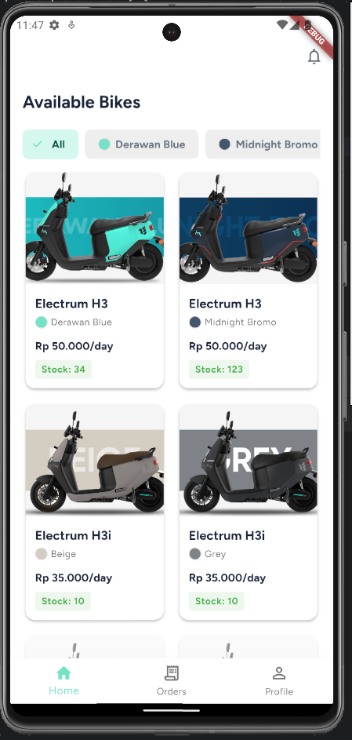
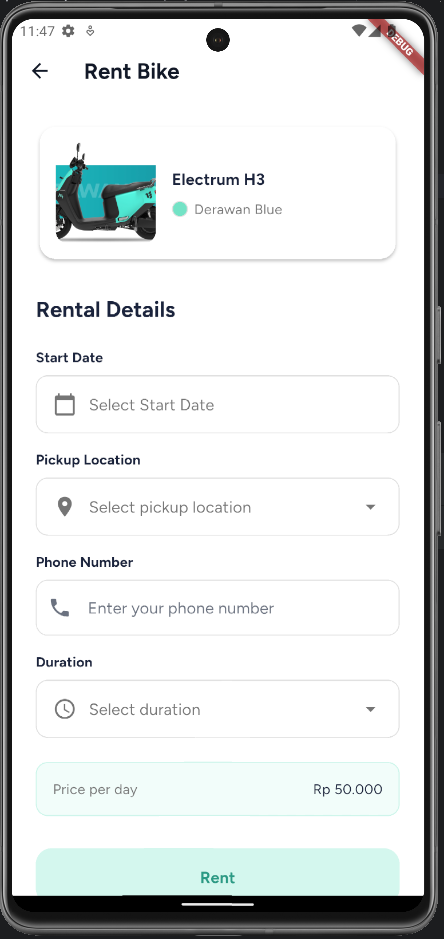
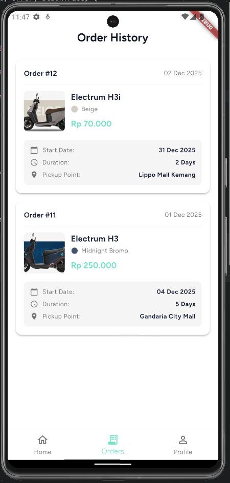

# Ezy Ride - Bike Rental Customer App

A modern Flutter-based bike rental application that allows customers to browse available bikes, view rental packages, and book bike rentals with ease.



## Table of Contents

- [Features](#features)
- [Screenshots](#screenshots)
- [Architecture](#architecture)
- [Project Structure](#project-structure)
- [Getting Started](#getting-started)
- [Dependencies](#dependencies)
- [Testing](#testing)

## Features

### Core Features
- **User Authentication**: Secure sign-up and sign-in with Supabase authentication
- **Home Feed**: Dynamic home sections with promotional banners, rental packages, and available bikes
- **Bike Browsing**: Browse and filter available bikes by color
- **Bike Details**: View detailed specifications including range, battery capacity, max speed, and pricing
- **Bike Rental**: Complete rental booking with date selection, pickup location, duration, and contact information
- **Order History**: View all past and current bike rental orders with full details
- **User Profile**: View user information and access app settings

### Technical Features
- **Smart Caching**: Rental packages are cached locally with SharedPreferences to reduce API calls and improve performance
- **Real-time Filtering**: Filter bikes by color with instant UI updates
- **Form Validation**: Comprehensive client-side validation for all user inputs
- **Error Handling**: User-friendly error messages with graceful error handling throughout the app
- **Internationalization (i18n)**: Multi-language support ready (currently English)
- **Responsive UI**: Adaptive layouts that work on different screen sizes
- **State Management**: Reactive state management with Riverpod
- **Offline-First**: Cached data ensures smooth experience even with poor connectivity

## Screenshots

<div style="display: flex; gap: 10px;">
  
  
  
</div>

## Architecture

This project follows **Clean Architecture** principles with a clear separation of concerns, making the codebase maintainable, testable, and scalable.

### Architecture Layers

```
┌─────────────────────────────────────────────┐
│          Presentation Layer                 │
│  (UI, Pages, Widgets, ViewModels)          │
└──────────────┬──────────────────────────────┘
               │
┌──────────────▼──────────────────────────────┐
│          Domain Layer                       │
│  (Entities, Repository Interfaces)          │
└──────────────┬──────────────────────────────┘
               │
┌──────────────▼──────────────────────────────┐
│          Data Layer                         │
│  (Repository Impl, Data Sources, Models)    │
└─────────────────────────────────────────────┘
```

#### 1. Presentation Layer
- **Pages**: Full-screen UI components (Login, Home, Bike Details, etc.)
- **Widgets**: Reusable UI components with their own state management
- **ViewModels**: Business logic and state management using Riverpod
- **State**: Freezed models for immutable state objects

**Key Components:**
- State management with Riverpod (AsyncNotifier pattern)
- Form validation logic
- Navigation handling
- UI error handling and loading states

#### 2. Domain Layer
- **Repository Interfaces**: Abstract contracts defining data operations
- **Use Cases** (implicit): Business logic encapsulated in repository interfaces

**Key Components:**
- `AuthRepository`: User authentication operations
- `BikeRepository`: Bike data operations
- `OrderRepository`: Rental and order operations
- `HomeRepository`: Home sections and packages

#### 3. Data Layer
- **Repository Implementations**: Concrete implementations of domain repositories
- **Data Sources**:
  - Remote: Supabase API integration
  - Local: SharedPreferences for caching
- **Models**: Data transfer objects with JSON serialization

**Key Components:**
- `SupabaseAuthDataSource`: Authentication with Supabase
- `SupabaseBikeDataSource`: Bike data from Supabase
- `SupabaseOrderDataSource`: Order management
- `PackageCacheDataSource`: Local caching for packages

### Why Clean Architecture?

We chose Clean Architecture for several compelling reasons:

#### 1. **Separation of Concerns**
Each layer has a single, well-defined responsibility:
- Presentation handles UI and user interactions
- Domain defines business rules
- Data manages data persistence and retrieval

#### 2. **Testability**
- **Independent Testing**: Each layer can be tested in isolation
- **Easy Mocking**: Repository interfaces make it simple to mock dependencies
- **Comprehensive Coverage**: We have extensive unit tests for all ViewModels
- Example: Our ViewModels can be tested without any UI or database dependencies

#### 3. **Maintainability**
- **Clear Structure**: New developers can quickly understand the codebase
- **Predictable Patterns**: Consistent patterns across features
- **Easy Updates**: Changes in one layer don't ripple through others

#### 4. **Scalability**
- **Feature Addition**: New features follow the same pattern
- **Team Collaboration**: Multiple developers can work on different layers simultaneously
- **Code Reusability**: Business logic is decoupled from UI and data sources

#### 5. **Flexibility**
- **Data Source Swapping**: Can easily switch from Supabase to another backend
- **UI Framework Changes**: Business logic remains unchanged if we switch UI frameworks
- **Multiple Platforms**: Same business logic can be shared across mobile, web, and desktop

#### 6. **Dependency Rule**
Dependencies point inward:
- Presentation → Domain ← Data
- Domain layer has zero dependencies on outer layers
- Changes in external frameworks (Flutter, Supabase) don't affect business logic

### State Management with Riverpod

We use **Riverpod** for state management because:

- **Compile-time Safety**: Errors are caught at compile time, not runtime
- **Provider Scope**: Clear provider lifecycle management
- **Testability**: Easy to test with provider overrides
- **Performance**: Fine-grained rebuilds only for affected widgets
- **Developer Experience**: Excellent DevTools support

### Code Generation

We leverage code generation for boilerplate reduction:

- **Freezed**: Immutable state classes with copyWith, equality, and serialization
- **JSON Serializable**: Automatic JSON parsing
- **Riverpod Generator**: Type-safe provider generation
- **Benefits**: Less boilerplate, fewer bugs, improved productivity

## Project Structure

```
lib/
├── core/
│   ├── exceptions/          # Custom exception classes
│   ├── helper/             # Helper utilities (error handling)
│   └── router/             # Navigation and routing
├── data/
│   ├── datasources/
│   │   ├── local/          # SharedPreferences caching
│   │   └── remote/         # Supabase API integration
│   ├── models/             # Data models with JSON serialization
│   └── repositories/       # Repository implementations
├── domain/
│   └── repositories/       # Repository interfaces
├── l10n/                   # Internationalization files
└── presentation/
    ├── page/              # Full-screen pages
    └── widgets/           # Reusable widgets

test/                      # Unit tests for ViewModels
```

## Getting Started

### Prerequisites

- Flutter SDK (>= 3.9.2)
- Dart SDK (>= 3.9.2)
- An IDE (VS Code, Android Studio, or IntelliJ)
- iOS Simulator / Android Emulator or physical device

### Installation

1. **Clone the repository**
   ```bash
   git clone <repository-url>
   cd sample_bike_customer_app
   ```

2. **Install dependencies**
   ```bash
   flutter pub get
   ```

3. **Run code generation**
   ```bash
   flutter pub run build_runner build --delete-conflicting-outputs
   ```

4. **Configure Supabase** (if not already configured)
   - Update Supabase credentials in the appropriate configuration file
   - Ensure your Supabase project has the required tables and RLS policies

5. **Run the app**
   ```bash
   # For development
   flutter run

   # For specific device
   flutter run -d <device-id>

   # For release build
   flutter run --release
   ```

### Building for Production

#### Android
```bash
flutter build apk --release
# Or for App Bundle
flutter build appbundle --release
```

#### iOS
```bash
flutter build ios --release
```

## Dependencies

### Core Dependencies
- **flutter_riverpod** (^2.6.1): State management
- **supabase_flutter** (^2.10.0): Backend and authentication
- **freezed_annotation** (^2.4.4): Immutable models
- **json_annotation** (^4.9.0): JSON serialization

### UI Dependencies
- **flutter_widget_from_html** (^0.15.2): HTML rendering
- **url_launcher** (^6.3.1): Open URLs and deep links

### Storage
- **shared_preferences** (^2.3.3): Local data caching

### Internationalization
- **intl** (^0.20.2): Date formatting and localization

### Development Dependencies
- **build_runner** (^2.4.13): Code generation
- **freezed** (^2.5.7): Model generation
- **json_serializable** (^6.8.0): JSON serialization generation
- **riverpod_generator** (^2.6.2): Provider generation
- **flutter_launcher_icons** (^0.14.1): App icon generation

### Testing Dependencies
- **mockito** (^5.4.4): Mocking for tests
- **mocktail** (^1.0.4): Alternative mocking library

## Testing

### Running Tests

```bash
# Run all tests
flutter test

# Run tests with coverage
flutter test --coverage

# Run specific test file
flutter test test/login_page_view_model_test.dart
```

### Test Coverage

We have comprehensive unit tests for all ViewModels:

- ✅ Login & Registration (with form validation)
- ✅ Home Tab (sections and packages)
- ✅ Order History (with refresh functionality)
- ✅ Profile (user data and logout)
- ✅ Bike List (with color filtering)
- ✅ Bike Rental (complete booking flow)
- ✅ Pickup Locations
- ✅ Rent Durations
- ✅ Promotional Banners

### Test Structure

Each ViewModel test includes:
- Initial state verification
- Success scenarios
- Error handling
- Loading states
- Data transformation
- User interactions

## Code Generation

When you modify models or providers, regenerate code with:

```bash
# Watch for changes and auto-generate
flutter pub run build_runner watch

# One-time generation
flutter pub run build_runner build --delete-conflicting-outputs
```

## App Icon

To regenerate app icons after changing the icon:

```bash
dart run flutter_launcher_icons
```

## Contributing

1. Follow the existing architecture patterns
2. Write tests for new ViewModels
3. Use Freezed for state classes
4. Generate code after model changes
5. Follow Dart/Flutter style guidelines

## License

This project is proprietary and confidential.

## Support

For support, please contact the development team.

---

Built with ❤️ using Flutter and Clean Architecture
